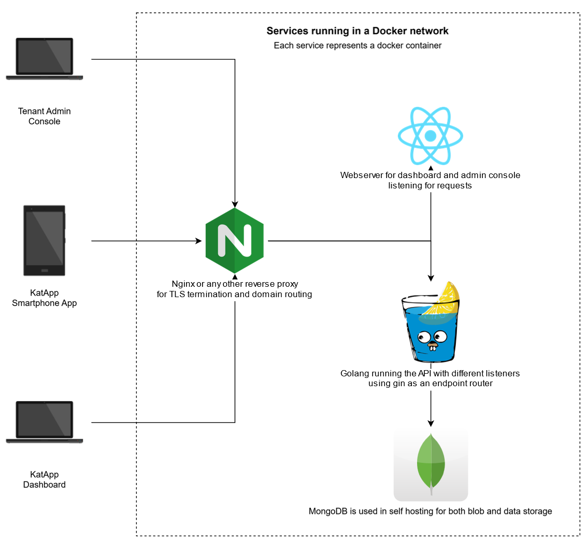

+++
title = "KatApp Overview"
weight = 1
+++

This document explains the overall purpose of the app, the solution architecture and how the individual parts work together. For documentation specific to one of the modules, check out the [additional documentation](/developer-documentation/additional-documentation/) section.

## Use Case

KatApp is designed for emergency medical triage during disasters and mass casualty incidents. When traditional emergency response systems are overwhelmed, medical personnel need a reliable, digital solution to quickly assess and prioritize patients for treatment.

### The Problem

During disasters (natural disasters, mass accidents, terrorist attacks), emergency medical teams face overwhelming challenges:
- **Chaotic environments** with limited resources and time
- **Multiple casualties** requiring rapid assessment and prioritization
- **Communication breakdowns** between field teams and command centers
- **Paper-based systems** that are slow, error-prone, and difficult to track

### The Solution

KatApp transforms emergency triage into a streamlined digital process:

1. **QR Code Scanning**: Each patient receives a unique QR code card. Medical personnel scan this code to instantly identify the patient and capture GPS location data.

2. **Guided Triage Process**: The app walks emergency doctors through a standardized triage assessment with clear, simple steps designed for high-stress situations.

3. **Real-time Data Sync**: Triage results are immediately transmitted to command centers, providing real-time situational awareness.

4. **Offline Capability**: The app works even when network connectivity is compromised, storing data locally until connection is restored.

### Key Workflows

**Field Triage Process:**
- Scan patient QR code → Capture location → Complete guided assessment → Save triage data
- If patient already exists, view previous triage or start new assessment
- All data automatically syncs to backend when connection available

**Command Center Monitoring:**
- Real-time dashboard shows triage counts, patient locations, and severity distributions
- Emergency management can make informed decisions about resource allocation
- Historical data helps improve future disaster response

**User Management:**
- Organizations can manage medical personnel accounts and device access
- Role-based permissions ensure appropriate access levels
- Device tokens enable secure app activation

### Target Users

- **Emergency Medical Personnel**: Doctors, paramedics, and first responders performing field triage
- **Emergency Management**: Command center staff monitoring disaster response
- **Hospital Administrators**: Staff managing medical resources and patient flow
- **Disaster Response Coordinators**: Officials overseeing overall emergency operations

This digital approach ensures faster, more accurate triage decisions while providing the situational awareness needed for effective disaster response coordination.

## Repositories

### [App](https://github.com/kat-app/katapp-app)

The App is the central piece of KatApp, used directly on-site by personnel performing triages. Built with Flutter, it can be deployed as native Android and iOS apps, as well as a web application.

### [Dashboard](https://github.com/kat-app/katapp-dashboard)

The Dashboard provides an overview of recorded triages and disaster information. Built with React and bundled with Vite for optimal static site hosting capabilities.

### [Tenant Admin Console](https://github.com/kat-app/tenant-admin-console)

The Tenant Admin Console is a Vite-powered React application for managing tenants and users within KatApp. It enables user creation, role management, and device token generation for app activation.

### [Backend](https://github.com/kat-app/katapp-backend)

The Backend is written in Go and supports both local deployment and AWS Lambda functions. This flexibility is achieved through code generation and dependency injection patterns.

### [Platform](https://github.com/kat-app/katapp-platform)

The KatApp Platform enables easy deployment of the complete system, including the web version of the app, via Docker. It's particularly useful for local testing and development workflows.

### [Docs](https://github.com/kat-app/katapp-docs)

The KatApp Documentation repository contains comprehensive information about app usage and development. This is the documentation you're currently reading.

### [Test Data Workflow](https://github.com/kat-app/test-data-workflow)

The Test Data Workflow repository contains scripts for rapidly generating triages and disaster data, enabling thorough testing of application changes with realistic datasets.

## Solution Architecture

The following diagram illustrates the solution architecture of the KatApp:

*KatApp Solution Architecture Diagram*

The KatApp solution architecture consists of several core modules that interact through a central backend:

- **Tenant Admin Console**: Used by organization administrators to manage users, roles, and devices. Handles registration, login, and device activation. Communicates with the backend via REST APIs.
- **App**: Used by triage teams in the field to perform and record triages. Features include patient management, triage steps, QR scanning, and offline data handling. Communicates with the backend via REST APIs.
- **Dashboard**: Used by evaluators to review triage and disaster data. Supports registration, login, and real-time updates via WebSocket connections in addition to REST APIs.
- **Backend**: The central hub that processes requests from all modules. It exposes multiple endpoints, manages authentication, data storage, and business logic. The backend is modular and scalable, supporting both local and cloud deployments.

**Data Flow:**
- All user-facing modules (Admin Console, App, Dashboard) interact with the backend for data storage, retrieval, and processing.
- The Dashboard leverages WebSocket connections for real-time updates, while other modules primarily use REST APIs.
- The backend orchestrates all business logic, ensuring data consistency and security across the system.

This architecture ensures clear separation of concerns, scalability, and flexibility for both local and cloud-based deployments.

## Deployment Architecture

### AWS

The following diagram illustrates the AWS deployment architecture of the KatApp:

*This diagram provides a high-level overview of how KatApp is deployed on AWS. It shows the interaction between client applications (App, Dashboard, Tenant Admin Console) and AWS-managed backend resources. Key AWS components and their roles are as follows:*

- **Amazon S3**: Hosts static assets such as frontend web applications and documentation. Client applications retrieve these assets directly from S3 via HTTPS.
- **API Gateway**: Serves as the main entry point for all API requests from client applications. It routes REST API calls to the appropriate backend Lambda functions, handling authentication and request validation.
- **AWS Lambda**: Implements the core business logic of the backend. Lambda functions are triggered by API Gateway events and interact with other AWS services (like DynamoDB and S3) to process requests and return responses.
- **DynamoDB**: Acts as the primary database for storing application data, including triages, user information, and disaster records. Lambda functions perform read/write operations on DynamoDB tables.
- **IAM (Identity and Access Management)**: Manages permissions and access control for AWS resources, ensuring that only authorized components and users can perform specific actions.
- **CloudFront**: Is used as a CDN to cache and accelerate delivery of static assets from S3 to end users globally.

*The diagram highlights how API Gateway, Lambda, and DynamoDB work together to provide a scalable, serverless backend, while S3 and CloudFront deliver static content efficiently. IAM enforces security across all interactions.*

### Local

The following diagram illustrates the local deployment architecture of the KatApp:

In local deployments, all core services run as Docker containers on a shared network:

- **Nginx (or reverse proxy)** handles TLS termination and routes requests to the correct service.
- **Webserver (React/Vite)** serves the Dashboard and Tenant Admin Console as static web apps.
- **Backend (Go/Gin)** exposes REST APIs, manages authentication, business logic, and data storage.
- **MongoDB** stores all application data and files.
- **App (Flutter)** is distributed via the Apple App Store and Google Play Store for end users, but can also be run locally or as a web app for development, connecting to the local backend through the reverse proxy.

All user-facing modules interact with the backend via the reverse proxy, ensuring secure and organized access. This setup enables rapid development, testing, and self-hosted deployments that closely mirror production.